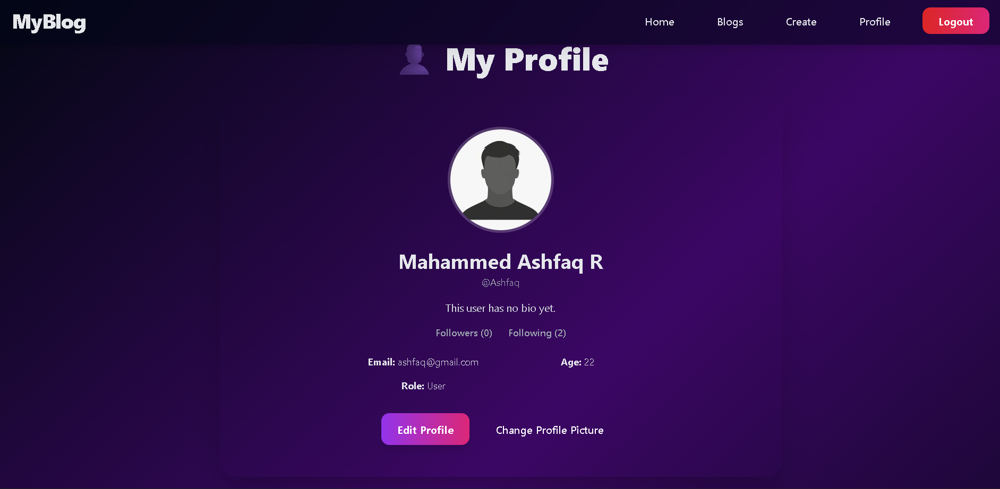

   # 📖 My Blog Hub

A modern blogging platform built with **Node.js, Express, MongoDB, and EJS**.  
It features user profiles, following system, blog creation, trending/latest sections, and clean UI with animations.  

---

## 🚀 Features

- 🔑 **Authentication** – Register, login, logout with secure sessions.  
- 👤 **Profile Pages** – View blogs, followers & following list.  
- ➕ **Blog Management** – Create, edit, delete posts.  
- 🌟 **Follow/Unfollow System** – Connect with other users.  
- 📊 **Trending & Latest** – Highlight recent and popular blogs.  
- 🎨 **UI Enhancements** – Tailwind CSS styling + AOS animations.  

---

## 🛠️ Tech Stack

- **Backend:** Node.js, Express  
- **Database:** MongoDB + Mongoose  
- **Frontend:** EJS, Tailwind CSS, AOS (animations)  
- **Authentication:** Express-session  
- **Deployment:** (e.g., Render/Railway/Heroku)  

---


## ⚡ Installation & Setup

1. **Clone the repository**
   ```bash
   git clone https://github.com/ashfaq3112/my-blog-hub.git
   cd my-blog-hub


2.**Install dependencies**
```bash
npm install
```

3.**Create a .env file in the root directory and add the following:**
```bash
PORT=3000
MONGODB_URI=your_mongodb_connection_string
SESSION_SECRET=your_secret_key
```

4.**Run the development server**
```
npm run dev
```

5.**Open in browser**
```
http://localhost:3000
```

## 📸 Screenshots

### 🏠 Home Page


### 👤 Profile Page


### ✍️ Blog Listing page


### ✍️ Blog Post Page


## 🤝 Contributing

1. Fork the repository  
2. Create a new branch  
   ```bash
   git checkout -b feature/your-feature
  '''3
3.Commit your changes
```
git commit -m "Added new feature"
```
4.Push the branch
```
git push origin feature/your-feature
```
5.Open a Pull Request 🎉


---

### 📜 License  
Add a license so others know how they can use your code.  

```markdown
## 📜 License

This project is licensed under the **MIT License** – free to use, modify, and distribute.


